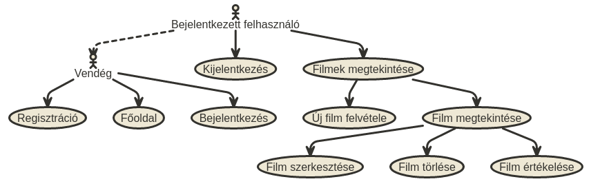
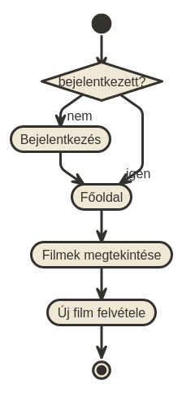
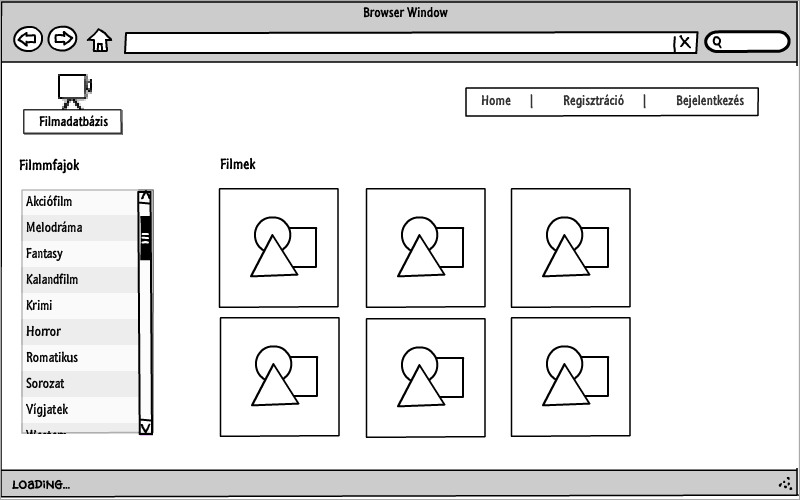
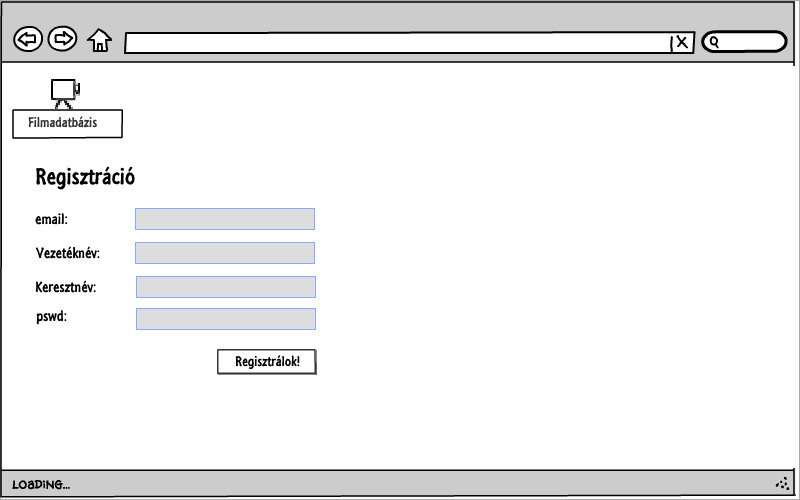
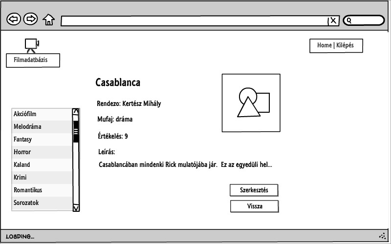

#Dokumentáció
##Filmadatbázis

Készítette: Dudás Orsolya (PJ1L4K)

##Követelmény-analízis
###Követelmények összegyűjtése
**Funkcionális követelmények**
+ Legyen lehetőség regisztrációra.
+ Regisztrálást követően a felhasználó be tudjon lépni, illetve ki tudjon jelentkezni.
+ Csak bejelentkezett felhasználók által elérhető funkciók:
  + új film felvétele az adatbázisba
  + a meglévő filmek szerkesztésére
  + a meglévő filmek törlése
  + filmek értékelése
  + filmek részletes adatainak megtekintése
  + új elem felvétele után a felhasználó visszakapja egy listában az eddig felvett elemeit, és azok leírását

**Nem funkcionális követelmények:**
+ Könnyű áttekinthetőség: filmműfaj szerinti csoportosítás
+ Használhatóság: könnyű áttekinthetőség, felhasználóbarát kinézet
+ Megbízhatóság: csak regisztrált felhasználó tudjon belépni

###Szakterületi fogalomjegyzék

+ **film:** olyan objektum, melynek, címe, rendezője, leírása, műfaja, illetve értékelése lehet
+ **értékelés:** a felhasználó által adott 1-től 10-ig terjedő egész szám
+ **lista:** filmek gyűjteménye
+ **módosítás:** film adott tulajdonságainak megváltoztatása
+ **törlés:** film eltávolítása a listából

**Filmműfajok:**

+ **Akciófilm:** Az akciófilmekben hagyományosan megtalálhatók a robbanások, az ökölharcok, a lövöldözések, a lovas és az autós üldözések.
+ **Melodráma:** A melodrámát nem ritkán tragikus vég jellemzi, szerelmi vetélkedésről, férfi és nő (szerelmi) konfliktusairól szól.
+ **Fantasy:** Mítikus, képzeletbeli helyszíneken játszódó hősi kalandokat mesél el, emberfeletti és földöntúli figurák főszereplésével.
+ **Horror:** A horrorfilm olyan alkotás, melyben félelem- és borzalomérzetet kívánnak kelteni a nézőben.
+ **Kaland:**  A kalandfilmek izgalmas eseményekben bővelkedő történetei a néző világától időben, térben távol játszódnak le. 
+ **Krimi:** Egy vagy több összefüggű bűncselekmény elkövetését és/vagy felderítését bemutató alkotás.
+ **Romantikus:** A vonzalmat, a kibontakozó vagy megújuló szerelmet két ember kapcsolatán keresztül bemutató mű.
+ **Sorozatok:** Több, nem ritkán 20-40 epizódból álló film.
+ **Vígjáték:** A vígjáték lazán szőtt cselekménye túlzásba vitt helyzetekkel és akciókkal, karikírozott nyelvvel és esendő karakterekkel dolgozik.
+ **Western:** Műfaji ismérve szerint a western az amerikai Vadnyugaton játszódó kalandfilm.

###Használatieset-modell

**Szerepkörök**

+ **Vendég:** Csak a publikus oldalakat éri el
  + Főoldal
  + Bejelentkezés
  + Regisztráció

+ **Bejelentkezett felhasználó:** A publikus oldalak elérésén felül egyéb funkciókhoz is hozzáfér.
  + Új film felvétele
  + Listában szereplő film megtekintése
  + Listában szereplő film szerkesztése
  + Listában szereplő film törlése
  + Film értékelése
  + Kijelentkezés
  
**Használati eset diagramok**

**Folyamatok pontos menete**

Új film felvételének folyamata:

1. A felhasználó az oldalra érkezve, ha nem bejelentkezett felhasználó, bejelentkezik
2. Ekkor a Főoldalra, majd a Filmek megtekintése oldalra kerül
3. A listaoldalon az "Új film felvétele" gombra kattint
4. Ekkor a "Filmek felvétele" oldalon felviszi az adatokat, elmenti, ezzel új filmet adva hozzá a listához.

##Tervezés
###Architektúra terv

**Oldaltérkép:**

+ **Publikus:**
  + Főoldal
  + Bejelentkezés
  + Regisztráció

+ **Bejelentkezett:**
  + Főoldal
  + Filmek listája
    + Új film felvétele
    + Film megtekintése
      + Film törlése
      + Film szerkesztése
      + Film értékelése
  + Kijelentkezés

**Végpontok**

+ **GET/**: főoldal
+ **GET/login**: bejelentkező oldal
+ **POST/login**: bejelentkező adatok felküldése
+ **GET/login/signup**: regisztrációs oldal
+ **POST/login/signup**: regisztrációs adatok felküldése
+ **GET/logout**: kijelentkező oldal
+ **GET/movies/list**: filmlista oldal
+ **GET/movies/new**: új film felvétele
+ **POST/movies/new**: új film felvételéhez szükséges adatok felküldése
+ **GET/movies/id**: kiválasztott film megtekintése
+ **POST/movies/id**: film értékelésének felvitele
+ **GET/movies/delete=id**: kiválasztott film törlése
+ **GET/movies/edit=id**: film módosítása
+ **POST/movies/edit=id**: film módosítása, adatok felküldése

###Felhasználóifelület-modell

**Oldalvázlatok**

**Főoldal**

**Regisztrációs oldal**

**Kiválasztott film oldala**

