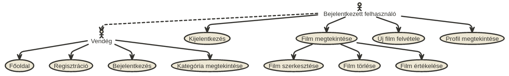
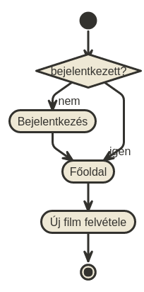
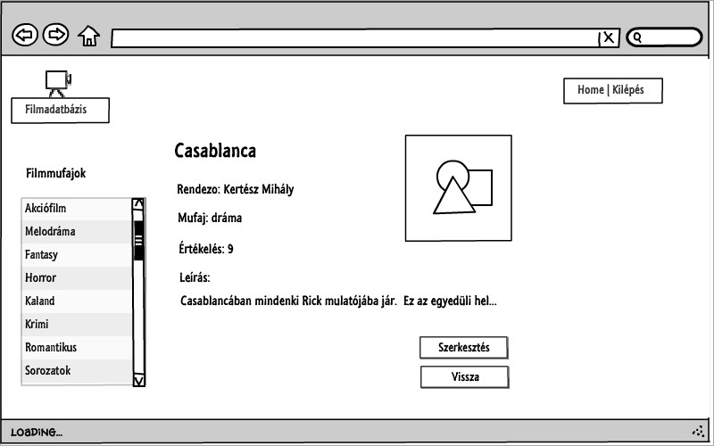
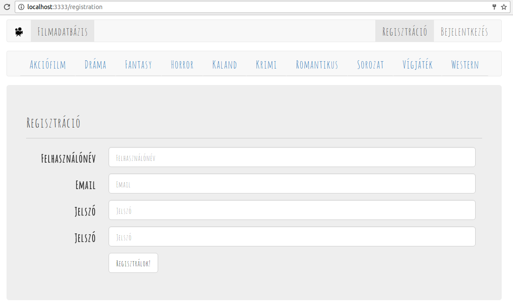
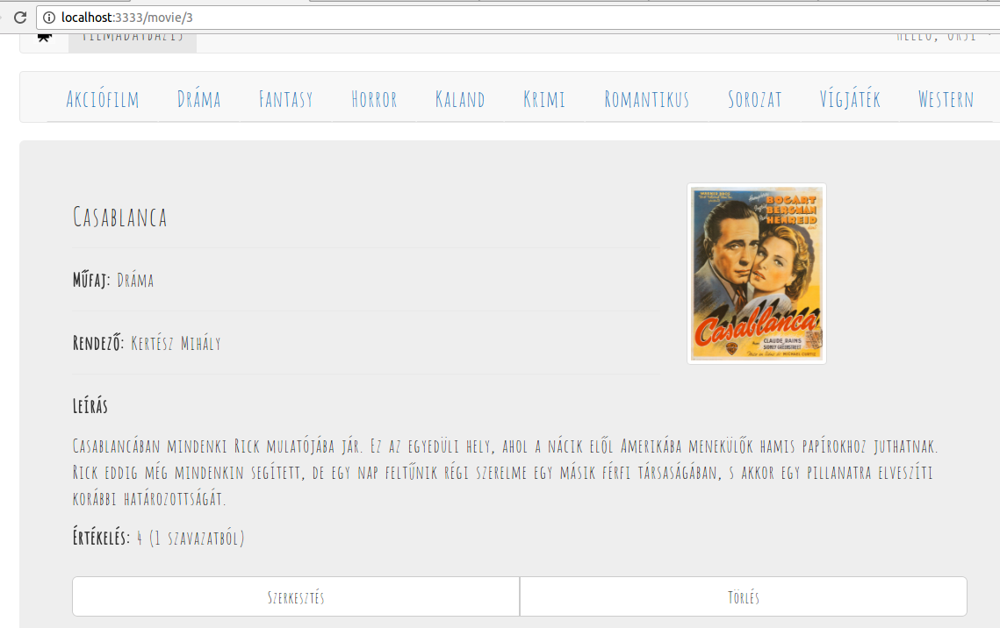
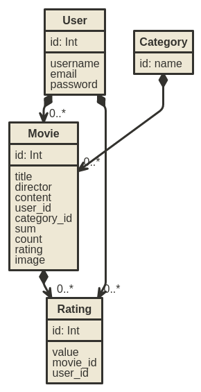
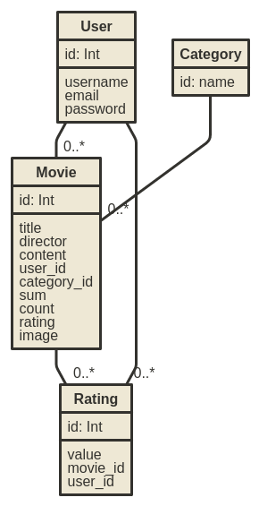

#Dokumentáció
##Filmadatbázis

Készítette: Dudás Orsolya (PJ1L4K)

##Követelmény-analízis
###Követelmények összegyűjtése
**Funkcionális követelmények**
+ Legyen lehetőség regisztrációra.
+ Regisztrálást követően a felhasználó be tudjon lépni, illetve ki tudjon jelentkezni.
+ Csak bejelentkezett felhasználók által elérhető funkciók:
  + új film felvétele az adatbázisba
  + a meglévő filmek szerkesztésére
  + a meglévő filmek törlése
  + filmek értékelése
  + filmek részletes adatainak megtekintése
  + új elem felvétele után a felhasználó visszakapja egy listában az eddig felvett elemeit, és azok leírását

**Nem funkcionális követelmények:**
+ Könnyű áttekinthetőség: filmműfaj szerinti csoportosítás
+ Használhatóság: könnyű áttekinthetőség, felhasználóbarát kinézet
+ Megbízhatóság: csak regisztrált felhasználó tudjon belépni

###Szakterületi fogalomjegyzék

+ **film:** olyan objektum, melynek, címe, rendezője, leírása, műfaja, illetve értékelése lehet
+ **értékelés:** a felhasználó által adott 1-től 5-ig terjedő egész szám
+ **lista:** filmek gyűjteménye
+ **módosítás:** film adott tulajdonságainak megváltoztatása
+ **törlés:** film eltávolítása a listából

**Filmműfajok:**

+ **Akciófilm:** Az akciófilmekben hagyományosan megtalálhatók a robbanások, az ökölharcok, a lövöldözések, a lovas és az autós üldözések.
+ **Melodráma:** A melodrámát nem ritkán tragikus vég jellemzi, szerelmi vetélkedésről, férfi és nő (szerelmi) konfliktusairól szól.
+ **Fantasy:** Mítikus, képzeletbeli helyszíneken játszódó hősi kalandokat mesél el, emberfeletti és földöntúli figurák főszereplésével.
+ **Horror:** A horrorfilm olyan alkotás, melyben félelem- és borzalomérzetet kívánnak kelteni a nézőben.
+ **Kaland:**  A kalandfilmek izgalmas eseményekben bővelkedő történetei a néző világától időben, térben távol játszódnak le. 
+ **Krimi:** Egy vagy több összefüggű bűncselekmény elkövetését és/vagy felderítését bemutató alkotás.
+ **Romantikus:** A vonzalmat, a kibontakozó vagy megújuló szerelmet két ember kapcsolatán keresztül bemutató mű.
+ **Sorozatok:** Több, nem ritkán 20-40 epizódból álló film.
+ **Vígjáték:** A vígjáték lazán szőtt cselekménye túlzásba vitt helyzetekkel és akciókkal, karikírozott nyelvvel és esendő karakterekkel dolgozik.
+ **Western:** Műfaji ismérve szerint a western az amerikai Vadnyugaton játszódó kalandfilm.

###Használatieset-modell

**Szerepkörök**

+ **Vendég:** Csak a publikus oldalakat éri el
  + Főoldal
  + Bejelentkezés
  + Regisztráció
  + Kategóriák

+ **Bejelentkezett felhasználó:** A publikus oldalak elérésén felül egyéb funkciókhoz is hozzáfér.
  + Új film felvétele
  + Listában szereplő film megtekintése
  + Felhasználó által felvett film szerkesztése
  + Felhasználó által felvett film törlése
  + Film értékelése
  + Profil megtekintése
  + Kijelentkezés
  
**Használati eset diagramok**

**Folyamatok pontos menete**

Új film felvételének folyamata:

1. A felhasználó az oldalra érkezve, ha nem bejelentkezett felhasználó, bejelentkezik
2. Ekkor a Főoldalra, majd a Filmek megtekintése oldalra kerül
3. A listaoldalon az "Új film felvétele" gombra kattint
4. Ekkor a "Filmek felvétele" oldalon felviszi az adatokat, elmenti, ezzel új filmet adva hozzá a listához.

##Tervezés
###Architektúra terv

**Oldaltérkép:**

+ **Publikus:**
  + Főoldal
  + Bejelentkezés
  + Regisztráció
  + Kategóriák

+ **Bejelentkezett:**
  + Főoldal
  + Új film felvétele
  + Film megtekintése
      + Film törlése
      + Film szerkesztése
      + Film értékelése
  + Profil megtekintése
  + Kijelentkezés

**Végpontok**

+ **GET/**: főoldal
+ **GET/login**: bejelentkező oldal
+ **POST/login**: bejelentkező adatok felküldése
+ **GET/logout**: kijelentkező oldal
+ **GET/registration**: regisztrációs oldal
+ **POST/registrationp**: regisztrációs adatok felküldése
+ **GET/movie/create**: új film felvétele
+ **POST/movie/create**: új film felvételéhez szükséges adatok felküldése
+ **GET/movie/:id**: kiválasztott film megtekintése
+ **GET/movie/:id/edit**: film módosítása
+ **POST/movie/:id/edit**: film módosított adatainak felküldése
+ **GET/movie/:id/delete**: kiválasztott film törlése
+ **POST/movie/:id**: film értékelésének felvitele
+ **GET/:id/category**: kiválasztott kategória megtekintése
+ **GET/profile**: adatlap megtekintése

###Felhasználóifelület-modell

**Oldalvázlatok**

Főoldal

Regisztrációs oldal

Kiválasztott film oldala

**Designtervek (végső megvalósítás kinézete)**

Főoldal

Regisztrációs oldal

Kiválasztott film oldala

###Osztálymodell

**Adatmodell**

**Adatbázisterv**

**Állapotdiagram**

##Implementáció

###Fejlesztői környezet bemutatása

**Lokális környezet**

+ Github account szükséges
+ Github kódtár létrehozása és klónozása (git clone https://...)
+ Külön mappa létrehozása a beadandó feladatnak
+ VSCode beállítása
+ Ezután elkezdhetjük a kód írását
+ VSCode-on belül mentjük a változásokat
+ VSCode segítségével egy vagy több fájlt kiválaszthatjuk és feltölthetjük a lokális tárolóból a Github-ra, illetve a terminál segítségével a git add, git commit, git push parancsokkal is elvégezhetjük ezeket a műveleteket. 
+ A Github oldalán leellenőrizhetjük a munkánkat.

###Könyvtárstruktúrában lévő mappák funkciójának bemutatása

+ beadando
  + app
    + Http
      + Controllers
        + MovieController.js
        + UserController.js
      + routes.js
    + Model
      + Category.js
      + Movie.js
      + Rating.js
      + User.js
  + database
    + migrations
      + 1478629334889_create_users_table.js
      + 1478629411527_categories.js
      + 1478629527025_movies.js
      + 1479204208962_ratings.js
    + development.sqlite
    + factory.js
  + resources/views
    + createMovie.njk
    + editMovie.njk
    + home.njk
    + login.njk
    + master.njk
    + profile.njk
    + registration.njk
    + showCategory.njk
    + showMovie.njk
    + welcome.njk
  + package.json
  + server.js

###Források

+ https://github.com/horvathgyozo/alkfejl_minta
+ http://webprogramozas.inf.elte.hu/alkfejl.php
+ http://ade.web.elte.hu/wabp/lecke2_lap1.html
+ http://cinema.gportal.hu/gindex.php?pg=36414110
