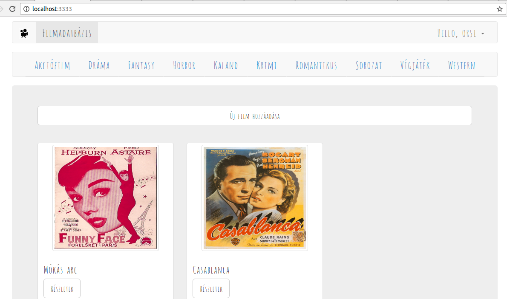

#Dokumentáció
##Filmadatbázis

Készítette: Dudás Orsolya (PJ1L4K)

##Követelmény-analízis
###Követelmények összegyűjtése
**Funkcionális követelmények**
+ Legyen lehetőség regisztrációra.
+ Regisztrálást követően a felhasználó be tudjon lépni, illetve ki tudjon jelentkezni.
+ Csak bejelentkezett felhasználók által elérhető funkciók:
  + új film felvétele az adatbázisba
  + a meglévő filmek szerkesztésére
  + a meglévő filmek törlése
  + filmek értékelése
  + filmek részletes adatainak megtekintése
  + új elem felvétele után a felhasználó visszakapja egy listában az eddig felvett elemeit, és azok leírását

**Nem funkcionális követelmények:**
+ Könnyű áttekinthetőség: filmműfaj szerinti csoportosítás
+ Használhatóság: könnyű áttekinthetőség, felhasználóbarát kinézet
+ Megbízhatóság: csak regisztrált felhasználó tudjon belépni

###Szakterületi fogalomjegyzék

+ **film:** olyan objektum, melynek, címe, rendezője, leírása, műfaja, illetve értékelése lehet
+ **értékelés:** a felhasználó által adott 1-től 5-ig terjedő egész szám
+ **lista:** filmek gyűjteménye
+ **módosítás:** film adott tulajdonságainak megváltoztatása
+ **törlés:** film eltávolítása a listából

**Filmműfajok:**

+ **Akciófilm:** Az akciófilmekben hagyományosan megtalálhatók a robbanások, az ökölharcok, a lövöldözések, a lovas és az autós üldözések.
+ **Melodráma:** A melodrámát nem ritkán tragikus vég jellemzi, szerelmi vetélkedésről, férfi és nő (szerelmi) konfliktusairól szól.
+ **Fantasy:** Mítikus, képzeletbeli helyszíneken játszódó hősi kalandokat mesél el, emberfeletti és földöntúli figurák főszereplésével.
+ **Horror:** A horrorfilm olyan alkotás, melyben félelem- és borzalomérzetet kívánnak kelteni a nézőben.
+ **Kaland:**  A kalandfilmek izgalmas eseményekben bővelkedő történetei a néző világától időben, térben távol játszódnak le. 
+ **Krimi:** Egy vagy több összefüggű bűncselekmény elkövetését és/vagy felderítését bemutató alkotás.
+ **Romantikus:** A vonzalmat, a kibontakozó vagy megújuló szerelmet két ember kapcsolatán keresztül bemutató mű.
+ **Sorozatok:** Több, nem ritkán 20-40 epizódból álló film.
+ **Vígjáték:** A vígjáték lazán szőtt cselekménye túlzásba vitt helyzetekkel és akciókkal, karikírozott nyelvvel és esendő karakterekkel dolgozik.
+ **Western:** Műfaji ismérve szerint a western az amerikai Vadnyugaton játszódó kalandfilm.

###Használatieset-modell

**Szerepkörök**

+ **Vendég:** Csak a publikus oldalakat éri el
  + Főoldal
  + Bejelentkezés
  + Regisztráció
  + Kategóriák

+ **Bejelentkezett felhasználó:** A publikus oldalak elérésén felül egyéb funkciókhoz is hozzáfér.
  + Új film felvétele
  + Listában szereplő film megtekintése
  + Felhasználó által felvett film szerkesztése
  + Felhasználó által felvett film törlése
  + Film értékelése
  + Profil megtekintése
  + Kijelentkezés
  
**Használati eset diagramok**

**Folyamatok pontos menete**

Új film felvételének folyamata:

1. A felhasználó az oldalra érkezve, ha nem bejelentkezett felhasználó, bejelentkezik
2. Ekkor a Főoldalra, majd a Filmek megtekintése oldalra kerül
3. A listaoldalon az "Új film felvétele" gombra kattint
4. Ekkor a "Filmek felvétele" oldalon felviszi az adatokat, elmenti, ezzel új filmet adva hozzá a listához.

##Tervezés
###Architektúra terv

**Oldaltérkép:**

+ **Publikus:**
  + Főoldal
  + Bejelentkezés
  + Regisztráció
  + Kategóriák

+ **Bejelentkezett:**
  + Főoldal
  + Új film felvétele
  + Film megtekintése
      + Film törlése
      + Film szerkesztése
      + Film értékelése
  + Profil megtekintése
  + Kijelentkezés

**Végpontok**

+ **GET/**: főoldal
+ **GET/login**: bejelentkező oldal
+ **POST/login**: bejelentkező adatok felküldése
+ **GET/logout**: kijelentkező oldal
+ **GET/registration**: regisztrációs oldal
+ **POST/registrationp**: regisztrációs adatok felküldése
+ **GET/movie/create**: új film felvétele
+ **POST/movie/create**: új film felvételéhez szükséges adatok felküldése
+ **GET/movie/:id**: kiválasztott film megtekintése
+ **GET/movie/:id/edit**: film módosítása
+ **POST/movie/:id/edit**: film módosított adatainak felküldése
+ **GET/movie/:id/delete**: kiválasztott film törlése
+ **POST/movie/:id**: film értékelésének felvitele
+ **GET/:id/category**: kiválasztott kategória megtekintése
+ **GET/profile**: adatlap megtekintése

###Felhasználóifelület-modell

**Oldalvázlatok**

Főoldal

Regisztrációs oldal

Kiválasztott film oldala

**Designtervek (végső megvalósítás kinézete)**

Főoldal

Regisztrációs oldal

Kiválasztott film oldala

###Osztálymodell

**Adatmodell**

**Adatbázisterv**

**Állapotdiagram**

Értékelés

##Implementáció

###Fejlesztői környezet bemutatása

**Lokális környezet**

+ Github account szükséges
+ Github kódtár létrehozása és klónozása (git clone https://...)
+ Külön mappa létrehozása a beadandó feladatnak
+ VSCode beállítása
+ Ezután elkezdhetjük a kód írását
+ VSCode-on belül mentjük a változásokat
+ VSCode segítségével egy vagy több fájlt kiválaszthatjuk és feltölthetjük a lokális tárolóból a Github-ra, illetve a terminál segítségével a git add, git commit, git push parancsokkal is elvégezhetjük ezeket a műveleteket. 
+ A Github oldalán leellenőrizhetjük a munkánkat.

###Könyvtárstruktúrában lévő mappák funkciójának bemutatása

+ beadando
  + app
    + Http
      + Controllers: Összekapcsolják a modelleket a nézetekkel.
        + MovieController.js
        + UserController.js
      + routes.js
    + Model: Az adatbázis kapcsolatokat írja le.
      + Category.js
      + Movie.js
      + Rating.js
      + User.js
  + config: A beállításokat tartalmazza.
    + express-admin
      + config.json
      + custom.json
      + settings.json
      + users.json
    + app.js
    + auth.js
    + database.js
    + session.js
  + database
    + migrations: Az adatbázis táblák sémáját szerkeszthetjük velük.
      + 1478629334889_create_users_table.js
      + 1478629411527_categories.js
      + 1478629527025_movies.js
      + 1479204208962_ratings.js
    + development.sqlite
    + factory.js
  + resources/views: A nézetek leíró fájlokat tartalmazza.
    + createMovie.njk
    + editMovie.njk
    + home.njk
    + login.njk
    + master.njk
    + profile.njk
    + registration.njk
    + showCategory.njk
    + showMovie.njk
    + welcome.njk
  + .env
  + package.json
  + server.js
  
##Progresszív fejlesztés kliensoldali JavaScript segítségével

###A funkcióban érintett fájlok mind kliens- és szerveroldalon

+ beadando/resources/views/master.njk
+ beadando/public/scripts/time.js
+ beadando/public/scripts/back.js
+ beadando/public/scripts/forward.js
+ beadando/resources/views/createMovie.njk
+ beadando/app/Http/Controllers/MovieController.js
+ beadando/app/Http/routes.js
+ beadando/public/scripts/delete.js
+ beadando/resources/views/showMovie.njk
+ beadando/app/Http/Controllers/UserController.js
+ beadando/public/scripts/login.js
+ beadando/resources/views/home.njk
+ beadando/public/scripts/reg.js
+ beadando/resources/views/showCategory.njk

###A funkció működésének, folyamatának szöveges leírása

+ Óra: 
  + Folyamatosan mutatja az időt
  + beadando/public/scripts/time.js kód fut le
  + lekéri az órát, percet, másodpercet, illetve, ha ezen értékek valamelyike 10-nél kisebb, kiegészíti egy 0-val a formátum miatt
+ Előre/Vissza gombok
  + forward.js illetve back.js kód
  + A gombra kattintással elérhető az előző/következő oldal, az oldal history-ját kérik le
+ Film hozzáadás validátor:
  + Ellenőrzi, hogy kitöltöttünk-e minden mezőt
  + Ha kitöltöttük, zöld pipával jelzi, ellenben piros x jelzi a hibát
+ Film törlésénél felugró ablak:
  + delete.js kód
  + Megkérdezi, biztosan töröljük-e a filmet
+ Bejelentkezésnél felugró ablak:
  + login.js kód
+ Regisztrációnál felugró ablak:
  + reg.js kód
  
###Szekvenciadiagram
  
##Tesztelés

###Tesztesetek felsorolása

A tesztesetek a tests mappában találhatóak.

1. Test suite 1: reg_log_add_del

  Amit tesztelni fog:

  + regisztrálás (név: bodza, email: bodza@bodza.hu, jelszó: bodza)
  + bejelentkezés (email: bodza@bodza.hu, jelszó: bodza)
  + film hozzáadása
  + film törlése

2. Test suite 1: log_add_categories_edit

  Amit tesztelni fog:

  + bejelentkezés (email: bodza@bodza.hu, jelszó: bodza)
  + film hozzáadása
  + kategóriák között lépegetés
  + hozzáadott film részleteinek megtekintése
  + hozzáadott film szerkesztése

###Tesztelési környezet bemutatása a dokumentációban (Selenium telepítése, tesztek futtatása)

**Selenium IDE telepítése:**

1. Mozzila Firefox indítása
2. Selenium IDE letöltése a https://addons.mozilla.org/hu/firefox/addon/selenium-ide/ oldalról
3. Mozzila Firefox->Menü megnyitása->Testreszabás->Selenium IDE beillesztése->Kilépés a testreszabásból
4. Selenium IDE elindítása

**Tesztek futtatása**

1. localhost:3333 megnyitása
2. JavaScript kikapcsolása a beállításokban (F12->Beállítások)
3. Fájl->Open Test Suite->"reg_log_add_del" kiválasztása->Megnyitás
4. Felül a slidert Fast-ről Slow-ra állítása
5. Kattintás a Play entire test suite gombra

##Felhasználói dokumentáció

###A futtatáshoz ajánlott hardver-, szoftver konfiguráció

Operációs rendszer: Windows 7/ Windows 10 / Ubuntu
Egyéb: Mozilla Firefox, JavaScript

###Telepítés lépései: hogyan kerül a Githubról a célgépre a program, hogyan kell elindítani

1. Kód letöltése:
  + ZIP letöltése
  + https://github.com/orsidudas/alkfejl_beadando klónozása (terminál futtatása + git clone ..)
2. Terminálban a alkfejl_beadando/beadando mappában elvégzendő műveletek: 
  + npm install
  + a .env.example fájl másolása és átnevezése .env-re
  + a kód  futtatás npm run dev vagy npm start paranccsal
3. Böngészőben (Mozzila/Chrome) localhost:3333 megnyitása

###A program használata

+ Böngészőben nyissuk meg a főoldalt
+ A bal felső sarokban levő ikonra kattintva mindig a főoldalra jutunk
+ A főoldalon szabadon váltogathatunk a filmműfajok között
+ Ha még nem regisztrátunk:
    + A jobb felső sarokban kattintsunk a Regisztráció gombra
    + Regisztráció után a bejelentkezési oldalra kerülünk, jelentkezzünk be!
+ Ha már regisztráltunk:
    + A jobb felső sarokban kattintsunk a Bejelentkezés gombra
    + Jelentkezzünk be!
+ A főoldalon:
    + szabadon váltogathatunk a filmműfajok között
    + rákattinthatunk a filmekre, hogy megnézzük a részletes adataikat
    + filmeket adhatunk hozzá az adatbázishoz
+ Filmek hozzáadása:
  + Kattintsunk a főoldalon a Film hozzáadása gombra
  + Töltsük ki az adatokat
  + Kattintsunk a Mentés gombra, illetve a Mégse gombra, ha mégsem kívánjuk felvinni az adatokat
+ Filmek részletes megtekintése:
  + A főoldalon kattintsunk a film névjegyén a Részletek gombra
  + Valamelyik filmműfaj oldalán kattintsunk a film névjegyén a Részletek gombra
+ Egy adott film szerkesztéséhez kattintsunk a film részletes adatlapján a Szerkesztés gombra (Ha mi adtuk hozzá)
+ Egy adott film törléséhez kattintsunk a film részletes adatlapján a Törlés gombra (Ha mi adtuk hozzá)
+ Egy adott film értékeléséhez a film részletes adatlapján válasszuk ki a számot majd kattintsunk az Értékelés gombra
+ Saját adatlap megtekintéséhez a jobb felső sarokban nyissuk le a fület és válasszuk az Adatlap gombot
+ Az adatlapon megtekinthetjük az adatainkat, az általunk hozzáadott filmeket, illetve ki is választhatjuk őket részletes megtekintésre
+ Kijelentkezéshez a jobb felső sarokban nyissuk le a fület és válasszuk a Kijelentkezés gombot

###Források

+ https://github.com/horvathgyozo/alkfejl_minta
+ http://webprogramozas.inf.elte.hu/alkfejl.php
+ http://ade.web.elte.hu/wabp/lecke2_lap1.html
+ http://cinema.gportal.hu/gindex.php?pg=36414110
